# Identity & Access Management Lab: Password Attacks and Domain Policy Hardening

## Overview
Hands-on lab exploring how weak password practices are exploited in a Windows Active Directory environment, and how to harden identity controls in response. The lab covers three password attack techniques — password spraying, dictionary attacks, and brute force cracking — followed by a domain-wide password policy remediation.

**Lab environment:**
- **Attacker machine:** Kali Linux
- **Target host:** Machine10 (Windows)
- **Domain Controller:** Windows Server 2019

**Tools used:** Hydra, John the Ripper (JtR)

---

## 1. Password Spraying Attack

Password spraying tests a single known (or assumed) password against many user accounts, rather than testing many passwords against one account. It's a live/online attack, and it's specifically designed to stay under account-lockout thresholds by trying only one or two passwords per account before moving on.

**What I did:**

Created a mount point to attach a network share once valid credentials were found:

Built a target password list:

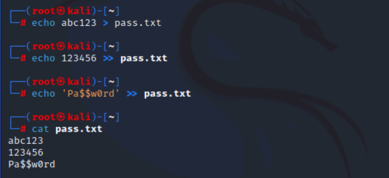

Used Hydra's wizard mode to run the spray against multiple accounts:

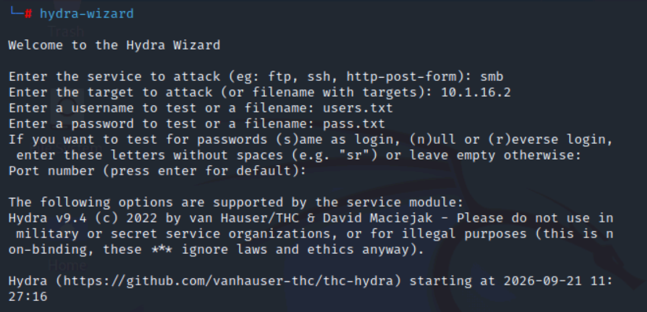

Identified two accounts sharing the same password:

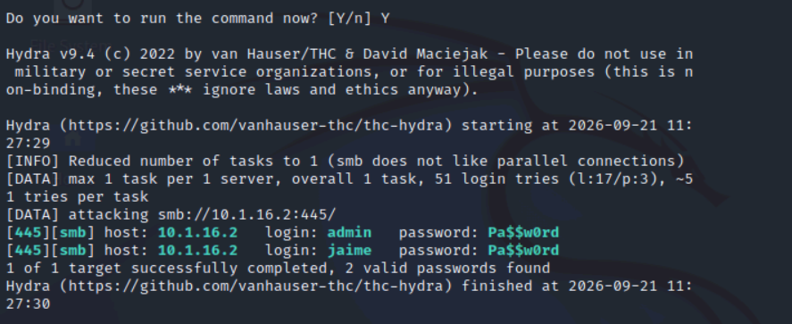

**Why it matters:** password spraying is a low-and-slow version of a dictionary attack — the goal isn't to crack a hash, it's to find *which* account a known password unlocks. It's a common real-world initial-access technique precisely because it evades naive lockout policies.

**Mitigation:** enforce password complexity and length requirements, train users against weak/shared passwords, and tune lockout thresholds so they catch low-volume spraying, not just brute force.

---

## 2. Dictionary Password Cracking

Unlike spraying, dictionary cracking is an **offline** attack — it targets password hashes directly rather than a live authentication service, so it isn't subject to account lockout at all.

**What I did:**

Extracted password hashes from Machine10:

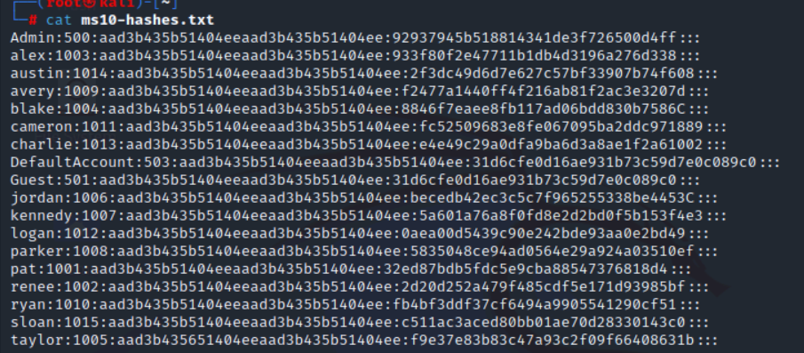

Reviewed available dictionary wordlists:

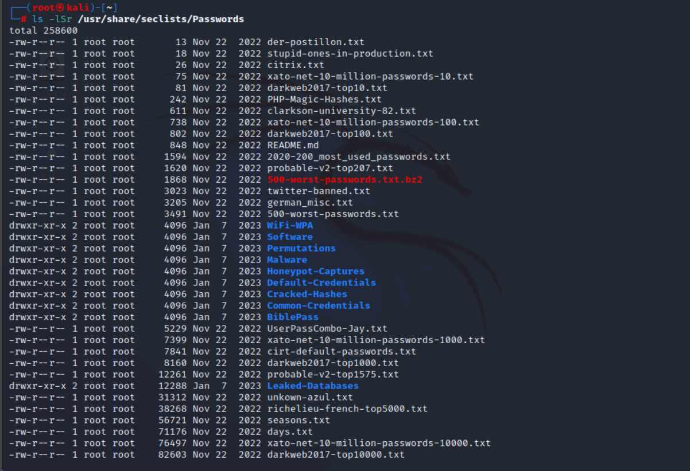

Ran John the Ripper against the hash file:

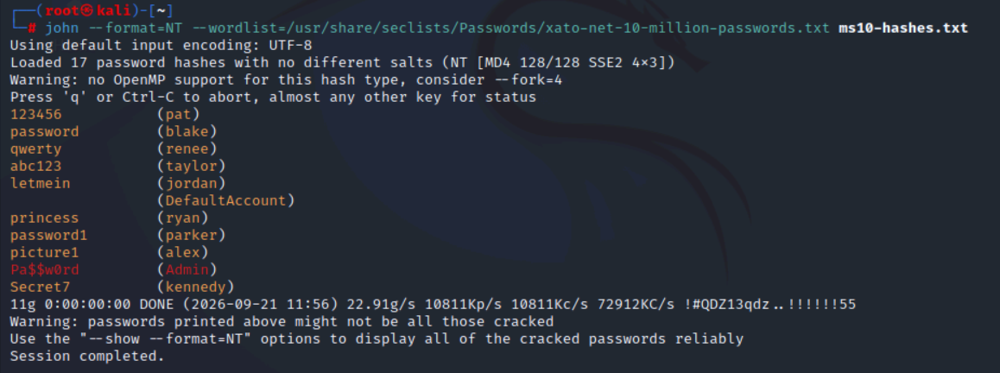

Reviewed which accounts hadn't been cracked:

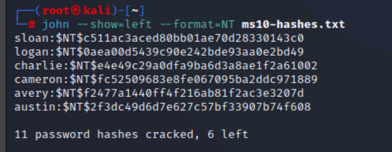

**Why it matters:** even strong hashing algorithms don't protect weak passwords — if the plaintext is in a common wordlist, it will be recovered regardless of the hash function's strength. This is the clearest demonstration in the lab that *password strength*, not just password storage, is the control that matters.

---

## 3. Brute Force Password Cracking

Where dictionary attacks rely on a wordlist, brute force systematically tries character combinations.

**What I did:**

Ran a brute force attack against the hash file:

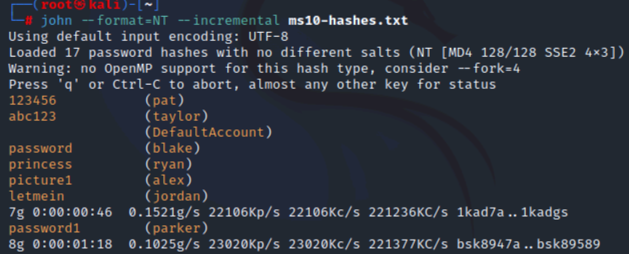

Compromised passwords with their hashes:

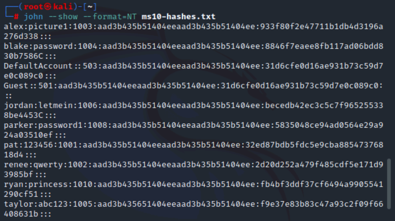

Ran a brute force attack capped at a 6-character maximum password length — it took noticeably longer to crack:

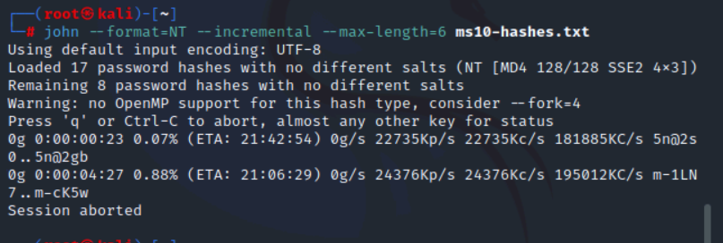

**Why it matters:** the time-to-crack for brute force scales fast with length and character set — this run made that cost visible rather than theoretical, which is the strongest practical argument for minimum password length policies.

---

## 4. Domain Password Policy Remediation

Using the findings from all three attacks, I reviewed the domain's existing password policy on the DC and identified it as insufficient, then implemented changes to close the gaps exploited above.

The current password policy:

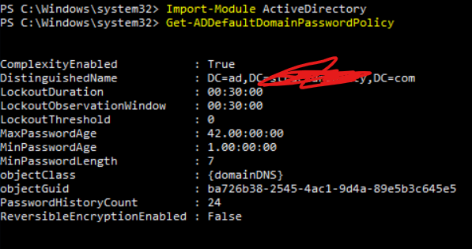

Changes made:

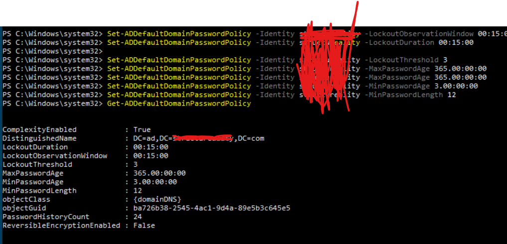

**This closes the loop:** attack → root cause → policy fix, rather than stopping at "the passwords were weak."

---

## Key Takeaways
- Password spraying, dictionary attacks, and brute forcing target different weaknesses (shared passwords, common passwords, and short passwords respectively) — each needs a distinct control, not just "make a stronger password."
- Offline attacks (dictionary/brute force against hashes) bypass account lockout entirely, so hashing strength and password length matter independently of login-attempt controls.
- Technical findings are only half the job — translating them into an actual domain policy change is what makes the exercise operationally useful.

## Relevant Skills / Certifications
CompTIA Security+ (SY0-701) · Identity and Access Management · Active Directory · Kali Linux · Hydra · John the Ripper
